# Diagrama de Classes - Sistema de Hospedagem

```mermaid
classDiagram
    class Residencia {
      +Long id
      +String endereco
      +String numero
      +String bairro
      +String cep
      +String telefone
      +String email
      +adicionarQuarto(quarto)
      +listarHistorico() List~Aluguel~
    }

    class Quarto {
      +Long id
      +String tipo
      +Decimal valorBase
      +Boolean arCondicionado
      +Boolean hidromassagem
      +calcularDiaria() Decimal
      +estaDisponivel(inicio, fim) Boolean
    }

    class Cliente {
      +Long id
      +String nome
      +String cpf
      +String endereco
      +String telefone
      +String email
      +String senhaHash
    }

    class Reserva {
      +Long id
      +DateTime dataEntrada
      +DateTime dataSaida
      +String status
      +calcularDiarias() Int
      +confirmar()
      +cancelar()
    }

    class Aluguel {
      +Long id
      +DateTime dataEntrada
      +DateTime dataSaida
      +Int quantidadeDiarias
      +Decimal valorFinal
      +fecharAluguel()
      +gerarRecibo() Recibo
    }

    class Pagamento {
      +Long id
      +Decimal valor
      +DateTime dataPagamento
      +String formaPagamento
      +String status
      +confirmarPagamento()
    }

    class Recibo {
      +Long id
      +DateTime emissao
      +String descricao
      +imprimirTela()
    }

    class ServicoDisponibilidade {
      +validarConflito(quarto, inicio, fim) Boolean
    }

    class ServicoPreco {
      +calcularValorDiaria(quarto) Decimal
      +calcularValorFinal(aluguel) Decimal
    }

    Residencia "1" --> "0..*" Quarto : possui
    Residencia "1" --> "0..*" Aluguel : historico
    Cliente "1" --> "0..*" Reserva : realiza
    Cliente "1" --> "0..*" Aluguel : contrata
    Quarto "1" --> "0..*" Reserva : reservado
    Quarto "1" --> "0..*" Aluguel : alugado
    Reserva "0..1" --> "0..1" Aluguel : convertido_em
    Aluguel "1" --> "1" Pagamento : gera
    Aluguel "1" --> "1" Recibo : emite
    ServicoDisponibilidade ..> Quarto : consulta
    ServicoPreco ..> Quarto : usa_dados
    ServicoPreco ..> Aluguel : calcula
```

## Observações
- As diárias iniciam às 12h.
- Entrada após 12h conta diária completa.
- Saída após 12h adiciona nova diária.
- Valor da diária = valor base + adicionais do quarto.
- Um quarto não pode ser alugado em período já ocupado.
