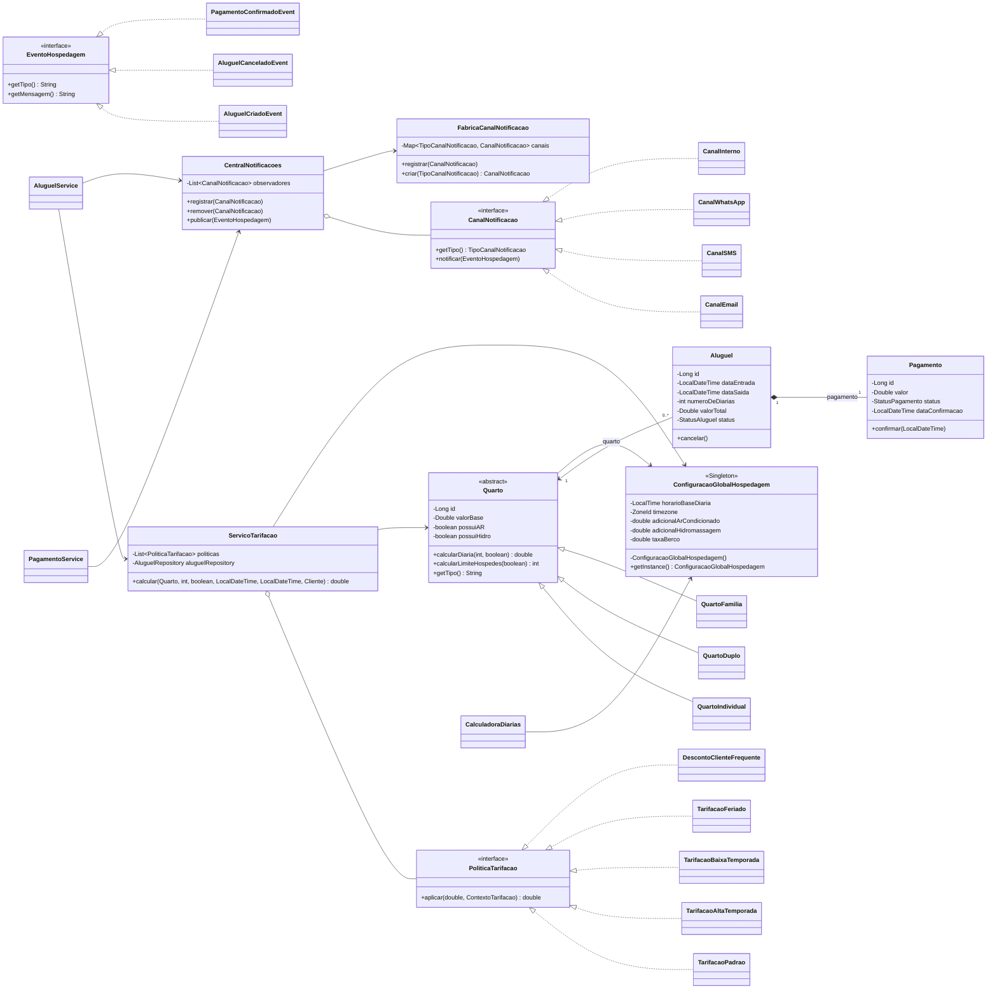

# UML — Sprint 4

```mermaid
classDiagram
direction LR

class Quarto {
  <<abstract>>
  -Long id
  -Double valorBase
  -boolean possuiAR
  -boolean possuiHidro
  +calcularDiaria(int, boolean) double
  +calcularLimiteHospedes(boolean) int
  +getTipo() String
}

class QuartoIndividual
class QuartoDuplo
class QuartoFamilia
Quarto <|-- QuartoIndividual
Quarto <|-- QuartoDuplo
Quarto <|-- QuartoFamilia

class Aluguel {
  -Long id
  -LocalDateTime dataEntrada
  -LocalDateTime dataSaida
  -int numeroDeDiarias
  -Double valorTotal
  -StatusAluguel status
  +cancelar()
}

class Pagamento {
  -Long id
  -Double valor
  -StatusPagamento status
  -LocalDateTime dataConfirmacao
  +confirmar(LocalDateTime)
}

Quarto "1" <-- "0..*" Aluguel : quarto
Aluguel "1" *-- "1" Pagamento : pagamento

class PoliticaTarifacao {
  <<interface>>
  +aplicar(double, ContextoTarifacao) double
}
class TarifacaoPadrao
class TarifacaoAltaTemporada
class TarifacaoBaixaTemporada
class TarifacaoFeriado
class DescontoClienteFrequente
PoliticaTarifacao <|.. TarifacaoPadrao
PoliticaTarifacao <|.. TarifacaoAltaTemporada
PoliticaTarifacao <|.. TarifacaoBaixaTemporada
PoliticaTarifacao <|.. TarifacaoFeriado
PoliticaTarifacao <|.. DescontoClienteFrequente

class ServicoTarifacao {
  -List~PoliticaTarifacao~ politicas
  -AluguelRepository aluguelRepository
  +calcular(Quarto, int, boolean, LocalDateTime, LocalDateTime, Cliente) double
}
ServicoTarifacao o-- PoliticaTarifacao
ServicoTarifacao --> Quarto
AluguelService --> ServicoTarifacao

class EventoHospedagem {
  <<interface>>
  +getTipo() String
  +getMensagem() String
}
class AluguelCriadoEvent
class AluguelCanceladoEvent
class PagamentoConfirmadoEvent
EventoHospedagem <|.. AluguelCriadoEvent
EventoHospedagem <|.. AluguelCanceladoEvent
EventoHospedagem <|.. PagamentoConfirmadoEvent

class CanalNotificacao {
  <<interface>>
  +getTipo() TipoCanalNotificacao
  +notificar(EventoHospedagem)
}
class CanalEmail
class CanalSMS
class CanalWhatsApp
class CanalInterno
CanalNotificacao <|.. CanalEmail
CanalNotificacao <|.. CanalSMS
CanalNotificacao <|.. CanalWhatsApp
CanalNotificacao <|.. CanalInterno

class CentralNotificacoes {
  -List~CanalNotificacao~ observadores
  +registrar(CanalNotificacao)
  +remover(CanalNotificacao)
  +publicar(EventoHospedagem)
}
class FabricaCanalNotificacao {
  -Map~TipoCanalNotificacao, CanalNotificacao~ canais
  +registrar(CanalNotificacao)
  +criar(TipoCanalNotificacao) CanalNotificacao
}
CentralNotificacoes o-- CanalNotificacao
CentralNotificacoes --> FabricaCanalNotificacao
AluguelService --> CentralNotificacoes
PagamentoService --> CentralNotificacoes

class ConfiguracaoGlobalHospedagem {
  <<Singleton>>
  -LocalTime horarioBaseDiaria
  -ZoneId timezone
  -double adicionalArCondicionado
  -double adicionalHidromassagem
  -double taxaBerco
  -ConfiguracaoGlobalHospedagem()
  +getInstance() ConfiguracaoGlobalHospedagem
}
Quarto --> ConfiguracaoGlobalHospedagem
ServicoTarifacao --> ConfiguracaoGlobalHospedagem
CalculadoraDiarias --> ConfiguracaoGlobalHospedagem
```
